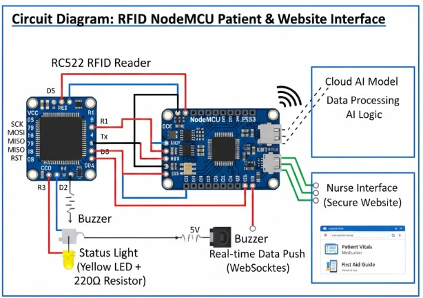
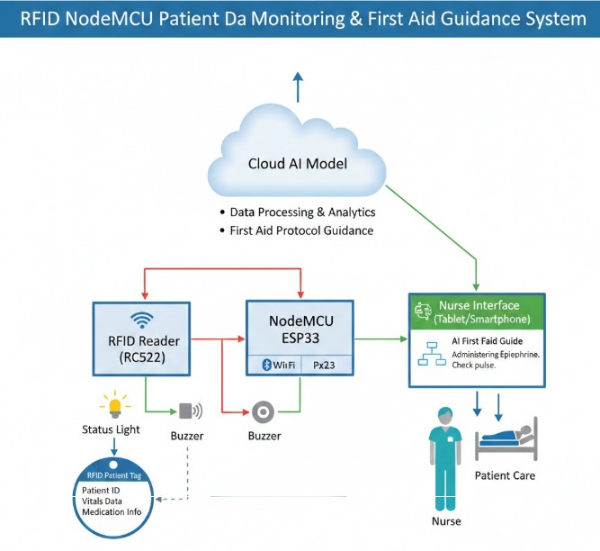

# **RFID + IoT Smart Patient Monitoring & First-Aid Guidance System**

*A cloud-connected NodeMCU + RFID healthcare solution for chronic and emergency patient support*

---

## 🏥 **Overview**

This project provides a **smart health monitoring system** where a patient’s RFID card can instantly display their **identity, chronic diseases, medical history, vitals, diet plan, doctor notes, and AI-based first-aid guidance**.

It is designed for:

* Patients with **chronic diseases** (Diabetes, Hypertension, CKD, Heart disease, etc.)
* **Alzheimer’s / memory-loss patients**
* **Elderly patients** who fall sick or unconscious
* **Emergency responders** (caretakers, family members, paramedics, nurses)

By simply **tapping the patient’s RFID card**, the system retrieves all medical details in real-time on a secure web dashboard.

---

## 🔥 **Problem Statement**

Patients with chronic or memory-related conditions often fall unconscious or cannot communicate their medical details during emergencies.
Doctors, nurses, or family members lose valuable time searching for:

* Past medical history
* Current medications
* Allergies
* Diabetes/Hypertension status
* Recent doctor notes
* Emergency protocols

⚠️ **In emergencies, delays in getting patient history may risk their life.**

---

## ✅ **Proposed Solution**

Using **RFID + NodeMCU ESP8266 + Web Dashboard + AI Assistant**, we built a system where:

1. Patient carries an **RFID card** containing their unique ID.

2. When tapped on the RFID reader:

   * NodeMCU retrieves UID
   * Sends UID to the server
   * Dashboard instantly loads the patient's:

     * Identity & conditions
     * Vitals & history
     * Doctor notes
     * Personalized diet
     * AI-generated first-aid steps
     * Similar case studies

3. **AI Assistant** provides:

   * First-aid protocols
   * Monitoring guidance
   * Condition-based recommendations

4. System is highly useful for:

   * ICU
   * Emergency wards
   * Home-care setups
   * Paramedics during transport

---

## 🧠 **Features**

### 🔹 **RFID-Based Patient Lookup**

Scan card → instantly fetch patient's history and medical profile.

### 🔹 **Web Dashboard (Node.js + Express + HTML/CSS/JS)**

* Patient Overview
* Diet Plan (auto-generated based on disease)
* Doctor Notes
* AI Assistant for first-aid
* Case Studies & history-based matching
* Real-time updates via WebSockets

### 🔹 **AI-Powered First Aid Guidance**

AI model provides emergency steps based on patient’s condition.

### 🔹 **Secure Cloud Storage**

* All patient records stored by UID
* Nurses and caretakers access via browser

### 🔹 **IoT Alerts**

* Buzzer & LED indication for card scan
* NodeMCU pushes data instantly

---

## 📡 **Tech Stack**

### **Hardware**

* NodeMCU ESP8266 / ESP32
* RC522 RFID Reader
* Passive RFID Cards
* LED + Buzzer

### **Software**

* **Arduino C++** (RFID → ESP Communication)
* **Node.js + Express.js** (Backend API)
* **HTML, CSS, JavaScript** (Frontend Dashboard)
* **WebSockets** (Real-time updates)
* **Cloud AI Model** (First-aid & analytics)

---

## 🔌 **Circuit Diagram**

## 🏗️ System Architecture

---

## 📲 **How It Works**

### **1️⃣ Patient Taps RFID Card**

NodeMCU reads UID using RC522.

### **2️⃣ NodeMCU Sends UID to Server**

Data sent via WiFi to Node.js backend.

### **3️⃣ Dashboard Loads Patient Profile**

Instantly shows:

* Medical history
* Diseases
* Medications
* Diet plan
* Doctor notes

### **4️⃣ AI Assistant Provides First-Aid**

Example:
“If patient has diabetes + sore throat → check sugar 4 times/day + warm saline gargles.”

### **5️⃣ Case Studies Section**

Shows past similar cases so junior doctors can refer quickly.

---

## 🚑 **Real-World Use Cases**

| Scenario                      | How System Helps                              |
| ----------------------------- | --------------------------------------------- |
| Patient becomes unconscious   | Tap card → get medical history instantly      |
| Alzheimer patient found alone | Shows identity + diseases + emergency contact |
| Paramedics during transport   | Quick view of vitals, medication, allergies   |
| Hospital ward rounds          | Doctors update notes live                     |
| Home caretakers               | Get diet, monitoring steps, and alerts        |

---

